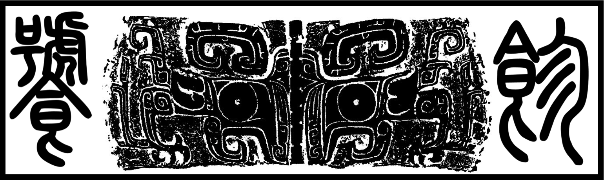

# Tao Tie (饕餮) - A curated collection of resources for astrophysical research

----

* “The taotie is a motif commonly found on Chinese ritual bronze vessels from the Shang and Zhou dynasty” - [Wikipedia](https://en.wikipedia.org/wiki/Taotie)

* Over the last few years, I have tried to collect useful resources for astrophysical research in several different ways.  Now, it seems a GitHub repo is the best solution. I will gradually transfer my notes and bookmarks here. This place is still heavily under construction. I will create a series of notes first, and I am thinking about what is the best way to organize them later. 

* Please let me know if you have any suggestion or recommendation.

## Contents
-----------

## Prepare yourself for scientific research

- [Setup your computer for research](https://github.com/dr-guangtou/taotie/blob/master/research/computer_basics.md)
    * Shell, command line tool, and system related stuff.

- [On writing scientific papers](https://github.com/dr-guangtou/taotie/blob/master/research/writing_paper.md) 
    * General advices, examples, and `LaTeX` related topics.

- [A little bit background in statistics](https://github.com/dr-guangtou/taotie/blob/master/research/stats_basic.md)
    * Courses and tutorials in statistics. Nowadays, you cannot get anywhere in astrophysics and cosmology without having enough knowledge of statistics.

- [A little bit background in data science](https://github.com/dr-guangtou/taotie/blob/master/research/data_science.md)
    * Data science related tutorial and cheatsheets.

## Starting your journey as astronomer

- [Good reference for all astronomers](https://github.com/dr-guangtou/taotie/blob/master/astro/astro_readme.md)
    * Reference and handbooks that will be handy in research.

- [Basic tools for astrophysical research](https://github.com/dr-guangtou/taotie/blob/master/astro/astro_research_basic.md)
    * Flux, extinction, coordinates, and planning your observations.  Whatever you need.

## `Python` - the official language for astronomers...for now

- [Basic Python knowledges](https://github.com/dr-guangtou/taotie/blob/master/python/python_basic.md)
    
- [On writing your own Python package](https://github.com/dr-guangtou/taotie/blob/master/python/python_write_yourown_project.md)

- [On improving the performance of your Python code](https://github.com/dr-guangtou/taotie/blob/master/python/python_performance.md)

- [Data fitting, parameter optimization, model constraints...you know, astrophysics](https://github.com/dr-guangtou/taotie/blob/master/python/python_optimazaton.md)

- [Doing statistical analysis right in Python](https://github.com/dr-guangtou/taotie/blob/master/python/python_statistics.md)

- [Making pretty pictures and other visualizations in Python](https://github.com/dr-guangtou/taotie/blob/master/python/python_visualization.md)

## Machine Learning 

* Since machine learning is becoming more and more important in astrophysics and cosmology, I am giving it an independent directory now.

- [Basics of machine learning](https://github.com/dr-guangtou/taotie/blob/master/mlearning/machine_learning_basic.md)
    * Online books, courses, handbooks...right now there are too many of them, so this might not be your best choice. 

## Resources for a Specific Topic in Astrophysics or Cosmology

* There is no way this is even close to a complete list.  It only reflects the interests of the author.  Contributions are welcomed, and will try to organize it better.

- [Basic tools for cosmology research](https://github.com/dr-guangtou/taotie/blob/master/topics/cosmology_tools.md)
    * CMB, 2PCF, and dark matter halos. All the fancy words you need in cosmology.

- [List of important extragalactic surveys and data](https://github.com/dr-guangtou/taotie/blob/master/topics/extragalactic_projects_and_data.md)
    * This could be a really...really long list, and should be organized better. 

- [What about dust?](https://github.com/dr-guangtou/taotie/blob/master/topics/ism_and_dust.md)
    * And all the other inappropriate questions in astrophysics.

Contribution
------------

Contribution from the community is highly welcomed! Please feel free to fork the repo and make you own change.  If you want your modifications be included in this repo, please submit a pull request (and make sure to describe the changes you made).

And if you notice anything wrong with the current content (wrong or unavailable link for example), please raise an issue.  

Also, if your repo or project is included here and you are not comfortable with that, just let me know. 

License
-------

Copyright 2019 Song Huang and contributors.

`taotie` is under the MIT License. For details see the LICENSE file.

